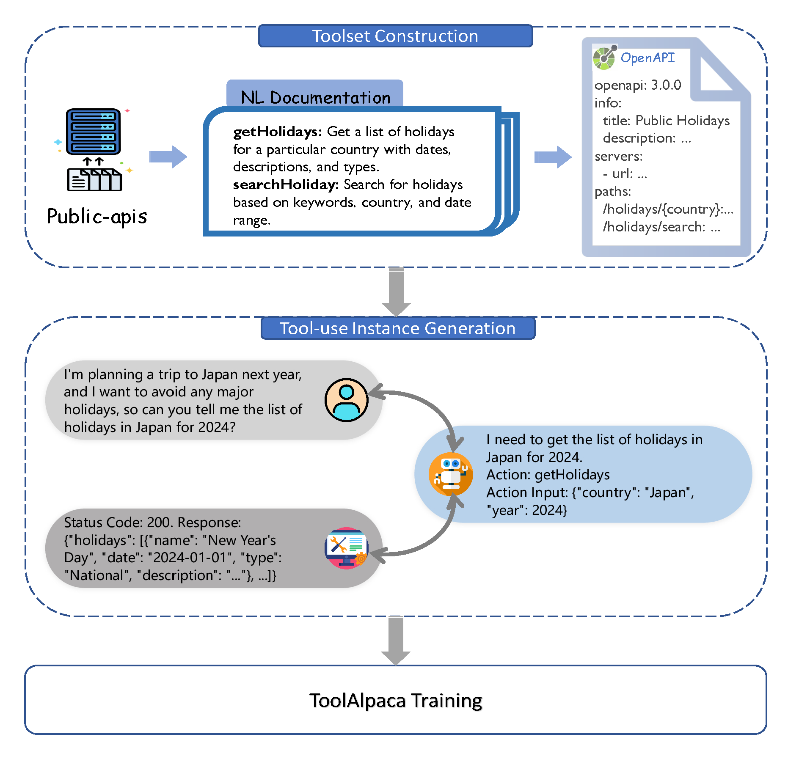

# ToolAlpaca: Generalized Tool Learning for Language Models with 3000 Simulated Cases

[](https://arxiv.org/abs/2306.05301)

`ToolAlpaca` is a framework designed for learning generalized tool-use abilities in compact language models with minimal human supervision. It addresses the challenge of tool learning by generating a tool-use corpus via a multi-agent simulation environment, providing 3.9k tool-use instances from more than 400 tools. 

<div align=center></div>


## News

- [06/14] We release the ToolAlpaca corpus with 3.9k instances.


## Data

\* **This work is still in progress. We may update the data as we make progress.**

Data format:

```json
{
  "Name": "name, from public-apis",
  "Description": "description, from public-apis",
  "Category": "category, from public-apis",
  "Introduction": "introduction, generated by LLM",
  "NLDocumentation": "natural language documentation, generated by LLM",
  "Documentation": "str(json), OpenAPI Specification documentation, generated by LLM",
  "Instances": [
    {
      "Input": "use's init instruction, from use agent",
      "Actions": [
        {
          "Thought": "LLM's thought, from assistant agent",
          "Action": "function name, from assistant agent",
          "Action Input": "str(json), parameters, from assistant agent",
          "Observation": "from [user agent, type check python code, tool executor agent]"
        }
      ],
      "Final Thought": "the final thought before output, from assistant agent",
      "Output": "final output, from assistant agent"
    }
  ]
}
```

The case in our paper:


```json
{
  "Name": "Public Holidays",
  "Description": "Data on national, regional, and religious holidays via API",
  "Category": "Calendar",
  "Introduction": "The Public Holidays API is a user-friendly interface that provides comprehensive information on national, regional, and religious holidays around the world...",
  "NLDocumentation": "1. Name: getHolidaysByCountry\nDescription: Retrieve a list of holidays for a specific country with dates, descriptions, and types...",
  "Documentation": "{...}",
  "Instances": [
    {
      "Input": "I'm planning a trip to Japan next year, and I want to avoid any major holidays, so can you tell me the list of holidays in Japan next year?",
      "Actions": [
        {
          "Thought": "I need to know which year the user is referring to.",
          "Action": "chatWithUser",
          "Action Input": "{\"Question\": \"Could you please specify the year you are planning your trip for?\"}",
          "Observation": "The year is 2024."
        },
        {
          "Thought": "I need to get the list of holidays in Japan for 2024.",
          "Action": "getHolidays",
          "Action Input": "{\"country\": \"Japan\", \"year\": 2024}",
          "Observation": "Status Code: 200 Response: {\"holidays\": [{\"name\": \"New Year's Day\", \"date\": \"2024-01-01\", \"type\": \"National\", \"description\": \"...\"}, ...]"
        }
      ],
      "Final Thought": "I have retrieved a list of holidays in Japan for 2024.",
      "Output": "The list of holidays in Japan for 2024 is New Year's Day (January 1st), Coming of Age Day (January 8th) ..."
    }
  ]
}
```


## Citation

If you find our work helpful, please cite as

```bibtex
@misc{tang2023toolalpaca,
      title={ToolAlpaca: Generalized Tool Learning for Language Models with 3000 Simulated Cases}, 
      author={Qiaoyu Tang and Ziliang Deng and Hongyu Lin and Xianpei Han and Qiao Liang and Le Sun},
      year={2023},
      eprint={2306.05301},
      archivePrefix={arXiv},
      primaryClass={cs.CL}
}
```
