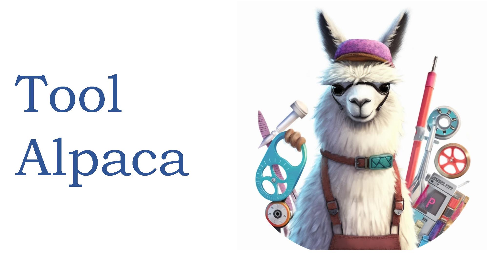

# ToolAlpaca: Generalized Tool Learning for Language Models with 3000 Simulated Cases

[](https://arxiv.org/abs/2306.05301)
[](https://huggingface.co/TangQiaoYu/ToolAlpaca-7B)
[](https://huggingface.co/TangQiaoYu/ToolAlpaca-13B)

<div align=center></div>

`ToolAlpaca` is a framework designed for learning generalized tool-use abilities in compact language models with minimal human supervision. It addresses the challenge of tool learning by generating a tool-use corpus via a multi-agent simulation environment, providing 3.9k tool-use instances from more than 400 tools. 

<div align=center></div>


## Data

Dataset list:

- train_data.json: training data with 400+ APIs
- eval_simulated.json: evaluation data with 10 simulated APIs
- eval_real.json: evaluation data with 11 real APIs, some APIs require authentication.

Data format:

```json
{
  "Name": "name, from public-apis",
  "Description": "description, from public-apis",
  "Category": "category, from public-apis",
  "Introduction": "introduction, generated by LLM",
  "Functions": "NLDocumentation in paper v1, generated by LLM",
  "Documentation": "str(json), OpenAPI Specification documentation, generated by LLM",
  "NLDocumentation": "natural language documentation, similar to Functions, converted from Documentation",
  "Function_Description": "each functions description in NLDocumentation",
  "Function_Projection": "function to HTTP request method",
  "Instructions": "instructions, generated by LLM",
  "Instances": [
    {
      "input": "use's init instruction, from use agent",
      "output": "final output, from assistant agent",
      "Final Thought": "the final thought before output, from assistant agent",
      "intermediate_steps": [
        [
          [
            "action, from assistant agent",
            "action input, str(json), from assistant agent",
            "thought + action + action input, assistant agent's output"
          ]
          "bbservation, from [user agent, type check python code, tool executor agent]"
        ]
      ]
    }
  ]
}
```

## Dataset Generation

- download public-api data
```bash
python tool_maker/preprocess_public_apis.py -api data/public_apis.json
```

- toolset construction
```bash
export PYTHONPATH=$PYTHONPAT:$(pwd)
export OPENAI_API_KEY=""

python tool_maker/get_elements.py -api data/public_apis.json -out ./data

python tool_maker/natural_language_documentation.py -api ./data/api_data.json
```

- tool-use instances generation
```bash
python instance_generation/instruction.py -api ./data/api_data.json -out ./data

python instance_generation/simulator.py -api ./data/api_data.json

python instance_generation/generation.py -api ./data/api_data.json -out ./data --use_cache
```

## Train
To train Toolapaca, we need to create a prompt to organize the dataset in a format that the standard SFT training code can read, similar to what is done in build_dataset.py. Afterward, we can proceed with training using the standard SFT method, only optimizing the loss on `thought`, `action`, and `action input`.

You can Find our models on huggingface hub: [ToolAlpaca-7B](https://huggingface.co/TangQiaoYu/ToolAlpaca-7B), [ToolAlpaca-13B](https://huggingface.co/TangQiaoYu/ToolAlpaca-13B).

## Evaluation
- for simulated APIs:
```bash
# start the api simulator
python instance_generation/simulator.py -api ./data/eval_simulated.json

# get LLM outputs
python instance_generation/generation.py \
  -api ./data/eval_simulated.json \
  -out ./eval \
  -llm TangQiaoYu/ToolAlpaca-13B \
  --agent_prompt test_v2 \
  --use_cache

# evaluation with LLM like GPT-4
python evaluation.py -api ${api_data_path} -out ./eval
```

- for real APIs:
You should register the websites and get the API_KEYs.

```bash
python instance_generation/generation.py \
  -api ./data/eval_real.json \
  -out ./data \
  -llm TangQiaoYu/ToolAlpaca-13B \
  --agent_prompt test_v2 \
  --real

python evaluation.py -api ${api_data_path} -out ./eval
```


## Citation

If you find our work helpful, please cite as

```bibtex
@misc{tang2023toolalpaca,
      title={ToolAlpaca: Generalized Tool Learning for Language Models with 3000 Simulated Cases}, 
      author={Qiaoyu Tang and Ziliang Deng and Hongyu Lin and Xianpei Han and Qiao Liang and Le Sun},
      year={2023},
      eprint={2306.05301},
      archivePrefix={arXiv},
      primaryClass={cs.CL}
}
```
